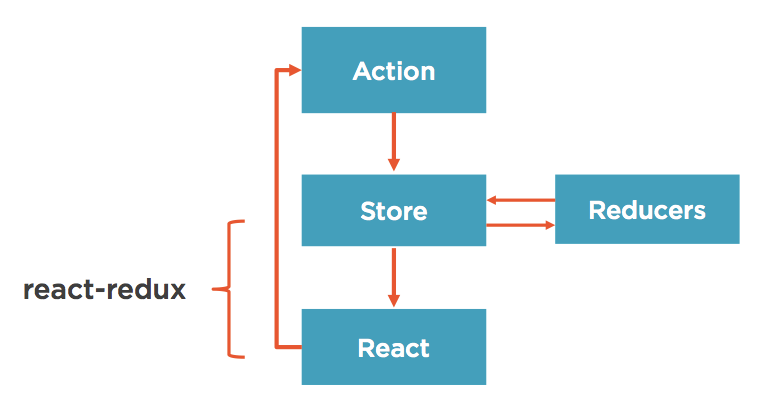

# Table of Contents:

- [React-Redux](#react+redux)
  - [Actions](#actions)
  - [Store](#store)
  - [Reducers](#reducers)
  - [Components](#components)
  - [React-Redux](#react-redux)
  - [React-router](#react-router)


# React+Redux

### Redux: 3 principles

1. One immutable store
2. Actions trigger changes
3. Reducers updates state


### Redux: new concepts from Flux

1. **Reducers**: functions that take the current state in an action and return a new state. Pure Functions!!
2. **Containers**: container component (holding logic, vs presentation components).
3. **Immutability**: immutable state


### Redux Flow

**React** - Hey CourseAction, someone clicked this "Save Course" button..

**Action** - Thanks React! I will dispatch an action so reducers that care can update state.

**Reducer** - Ah, thanks action. I see you passed me the current state and action to perform. I'll make a new copy of the state and return it.

**Store** - THanks for updating the state reducer. I'll make sure that all connected components are aware.

**React-Redux** - Woah, thanks for the new data Mr. Store. I'll now intelligently determine if I should tell React about this change so that it only has to bother with updating the UI when necessary.

**React** - Ooo! Shiny new data has been passed down via props from the store! I'll update the UI to reflect this!

 


## Actions

It is a plain object containing the description of an event.

##### Example

```javascript
//action
{ type: RATE_COURSE, rating: 5 }

// action creator
function rateCourse(rating){
  return { type: RATE_COURSE, rating: rating }
}
```


## Store

Create store by calling `let store = createStore(reducer);`

Store API:

- `store.dispatch(action)`
- `store.subscribe(listener)`
- `store.getState()`
- `replaceReducer(nextReducer )`

*NOTE: you can't change the store directly but rather via an reducer*

#### Immutability:

"to change state, return a new object and replace the state"

Already immutable:

- number
- string
- boolean
- undefined
- null

*Mutable: Objects, Arrays, Functions*

**Example**

```javascript
state = {
  name: 'Juan Greco',
  role: 'developer'
}

// traditional mutating state
state.role = 'admin';
return state;

// return new object (not mutating state)
return state = {
  name: 'Juan Greco',
  role: 'admin'
}
```


**Problem**: do I have to make a new definition everytime I want to make a change?

**Solution**: make a deep copy of the object and modify the copy instead.

**How**: using a new method that is part of ES6, `Object.assign(target, ...sources)`. It creates a new object but allows to specify existing objects as a template. You define a target object and then as many sources as you want.

```javascript
// my state object
state = {
  name: 'Juan Greco',
  role: 'developer'
}

Object.assign({}, state, {role: 'admin'});
```

**NOTE**: babel cannot transpile this feature, so be sure to include **babel-polyfill**

**NOTE2**: alternatives for deep copy:

ES6

- Object.assign
- Spread operator

ES5

- lodash merge
- lodash extend
- object-assign

Libraries

- react-addons-update
- Immutable.js


##### Why Immutability?

1. **Clarity**: available to know **who** changed a state (which reducer).
2. **Performance**: avoid checking all the properties since we are now refering to a new object (if it is new it means there has been a deep copy done, therefore *state updated*).
3. **Awesome Debugging**: time travel debugging, undo/redo


##### How to enforce immutability?

**redux-immutable-state-invariant**: library display an error when trying to mutate state (only use on development!)

**Immutable.js** powerful library (might be an overkill)


#### Container Component: 5 major pieces

1. **constructor**:  initialise state (and call bind functions ES6)
2. **child functions**: helper functions called by render()
3. **render**: call a child component
4. **propTypes**: for type validation (optional)
5. **Redux Connec**t and related functions: mapStateToProps, mapDispatchToProps, connect()()


## Reducers

#### Definition

It's a function that takes `state` and `action` object and returns a `new state`.

```javascript
(state, action) => state
```

**Reducer is a pure function!** ie. if when calling it with the same set of arguments always returns the same value.


##### Forbidden in Reducers:

- mutate arguments
- perform side effects
- call non-pure functions


**Example**:

```javascript
function myReducer(state, action){
  switch (action.type){
    case 'INCREMENT_COUNTER':
      return(
        Object.assign(
          {},
          state,
          {counter: state.counter + 1}
      	)
      );
      break;
    default:
      return state;
  }
}
```


NOTE: **ALL** Reducers are called on each dispatch! So it is important to return the untouched state if it should not affect the state.


## Components

### Types

There are two types:

- **container** ~ smart components, used when need:
  - behaviour (little to no markup)
  - pass data and actions down
  - knows about redux
  - often stateful
- **presentation** ~ templates, used when:
  - dumb components (nearlly all markup)
  - receive data via props
  - no redux
  - no state


### Declaring Components

*when to use which?*

**Class Component** (~usually for container components):

- **State** (if you need state)
- **Refs** (if you need reference to the underlying DOM)
- **Lifecycle method** (if you need use of these)
- **Child functions** (if need to use these, for performance issues)

**Stateless Component** (~usually for presentation components):

- everywhere else


#### Class Component

```jsx
// ES6 only
class Contacts extends React.Component {
  constructor(props){
    super(props);
    this.handleClick = this.handleClick.bind(this);
  }
  render(){
    return (
      <h1>Hello World</h1>
    );
  }
}
```

Props

- no autobind
- propTypes declared separately
- default props declared separately
- set initial state in constructor


#### Stateless Functional Component

```jsx
// ES5
var HelloWorld = function(props){
  return (
    <h1>Hello World</h1>
  );
};

//ES6
const HelloWorld = (props) => {
  return (
    <h1>Hello World</h1>
  );
};
```

Props

- stateless, doesn't support state
- functional components (no class keyword needed)
- no need to use bind (for this)
- higher performance


#### Extra:

Other ways to create components:

- Object.create
- Mixins
- Parasitic Components
- StampIt


## React-Redux

It connects your React components to your redux library. It is composed of two core items:

1. **Provider** - attached app to store (@app root)
2. **Connect** - creates container components


**Provider**:

```jsx
// give access to the store to all the App
<Provider store={this.props.store}>
	<App/>
</Provider>
```


**Connect**:

```javascript
export default connect(
  mapStateToProps,      // <- state you want to connect
  mapDispatchToProps    // <- actions you want to connect
)(AuthorPage);
```

**mapStateToProps** (optional)

It is function to defined what part of Redux store to expose to the component. Any time the store updates, mapStateToProps will be called. Use this function to filter/transform the state to be used. eg.

```javascript
function mapStateToProps(state){
  return {
    appState: state // we pass all the state
  };
}

// in my component: this.props.appstate
```

**mapDispatchToProps** (optional)

It is a function that does the same as `mapStateToProps`  but for actions. It specifies what actions we want to expose to the component (instead of state)

```javascript
function mapDispatchToProps(dispatch){
  return {
    actions: bindActionCreators(actions, dispatch)
  };
}
```

**3 ways to handle `mapDispatchToProps`:**

1. **Ignore it**

   so each time you want to fire an action you will write something like this: `this.props.dispatch(createUser());`

2. **Manully wrap**

   one by one wrap each action creator in a dispatch call

   ```javascript
   function mapDispatchToProps(dispatch){
     return {
       createUser: () => {
         dispatch(createUser());
       },
       deleteUser: () => {
         dispatch(deleteUser());
       }
     }
   }
   // in component: this.props.createUser()
   ```

3. **Use `bindActionCreators`**

   ```javascript
   function mapDispatchToProps(dispatch){
     return{
       actions: bindActionCreators(actions, dispatch)
     };
   }
   // in components: this.props.actions.createUser()
   ```


## React-router

```jsx
// routes.js
import React from 'react';
import { Route, IndexRoute } from 'react-router';

import App from './components/App';
import HomePage from './components/home/HomePage';
import AboutPage from './components/about/AboutPage';

export default(
  <Route path="/" component="{App}">
    <IndexRoute component="{HomePage}" />
    <Route path="about" component="{AboutPage}" />
  </Route>
);
```

The component defined in `Route` will always be loaded (in this case `App`).

The components `IndexRoute` and `Route` found as childs, will be passed to it's parent `App` as children via `props`.


```jsx
// App.js
import React, {PropTypes} from 'react';

class App extends React.Component {
  render() {
    return (
      <div className="container-fluid">
        <p>Header here...</p>
        {this.props.children} // <-- see note below
        /* IndexRoute and Route ie 'HomePage', and 'AboutPage'
           are added here according to clicking/routing behaviour **/
      </div>
    );
  }
}

App.protoTypes = {
  children: PropTypes.object.isRequired
};

export default App;
```


And to finish set up an **entry point** on the application file to use the react-router: `index.js`


```jsx
import ...
render(
  <Router history={browserHistory} routes={routes} />,
  document.getElementById('app')
);
```
